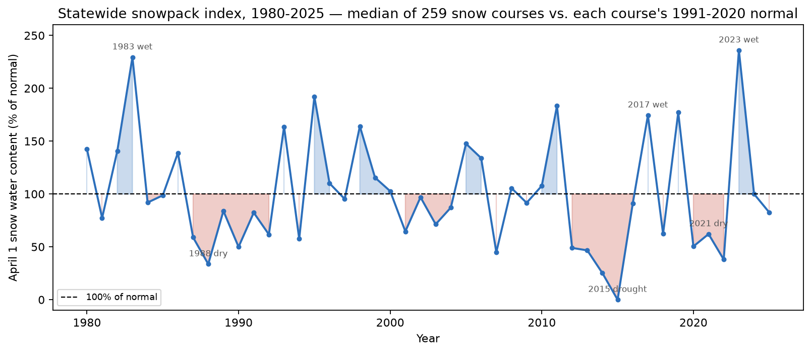
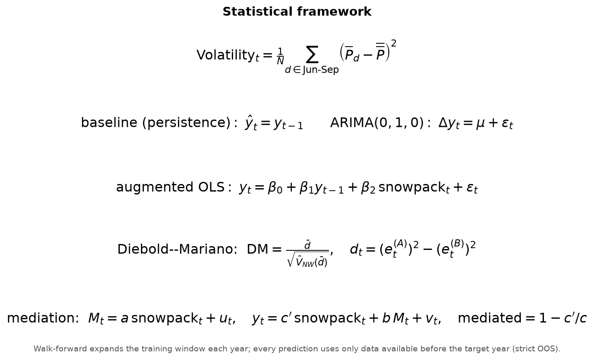
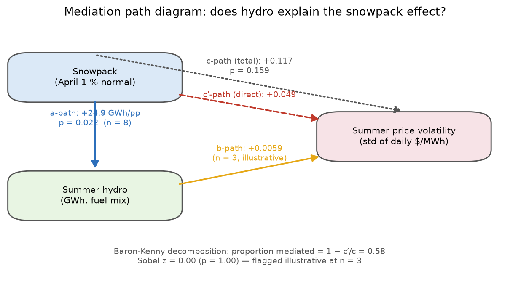

<div align="center">

# Snowpack → Hydropower → Electricity Prices

**A reproducible causal-chain study: does California's April 1 snowpack predict
summer electricity-price behavior through hydroelectric generation?**

`Python · pandas · numpy · statsmodels · scikit-learn · gridstatus · EIA-930 · CDEC · CAISO OASIS`

</div>

---

## TL;DR

- **Pipeline**: end-to-end ETL → feature engineering → forecasting → statistical
  inference, fully reproducible from public data, cached, and unit-tested
  (12 tests).
- **Real data**: 129,784 snow-course measurements (1980–2025), CAISO day-ahead
  LMP at 3 trading hubs, and 5-minute hydro generation — cross-validated
  against an independent EIA-930 series (agreement within ~2%).
- **Key statistical finding**: the first stage of the causal chain is
  significant — **+24.9 GWh of summer hydro per +1 pp of snowpack** (p = 0.022,
  R² = 0.61, n = 8), confirmed by a second data source.
- **Honest caveat**: public CAISO LMP history currently only serves 2023–2025,
  so all price-behavior statistics are explicitly flagged **illustrative
  (n = 3)**. The machinery is built to run at full power the moment longer
  price history is available.

---

## 1. Research question & hypothesis

> Does winter/spring snowpack in California predict summer electricity price
> behavior via hydroelectric generation capacity?

**Hypothesized causal chain:**

```
April 1 snowpack ──(a)──▶ summer hydro generation ──(b)──▶ summer price behavior
       │                                                        ▲
       └────────────────────(c′)────────────────────────────────┘
```

- **a-path**: wet winters → more snow water content → more summer hydro output.
- **b-path**: more cheap hydro dispatch → lower and *calmer* prices.
- **c′-path**: any snowpack effect *not* mediated by hydro (direct effect).

The mediation framework (Baron & Kenny, 1986, with a Sobel test of the indirect
effect) asks whether controlling for actual hydro output **kills** the direct
snowpack effect — which would confirm the mechanism.

---

## 2. Architecture


| Stage | Module | Responsibility |
|---|---|---|
| Data acquisition | `fetch_cdec.py`, `fetch_caiso_oasis.py`, `fetch_eia.py` | Pull raw data from CDEC, CAISO OASIS, EIA-930; cache to `data/raw/` |
| Feature engineering | `features.py` | Build the yearly panel: snowpack index, summer price features, summer hydro |
| Modeling | `models.py` | Baselines + augmented models, expanding-window walk-forward, DM test, mediation |
| Orchestration | `run_pipeline.py` | End-to-end run → `results/` (plot, RMSE table, `results.json`) |
| Notebooks | `notebooks/01_eda`, `02_mediation_analysis`, `03_walkforward_backtest` | Executed analysis narrative |
| Tests | `tests/` | 12 unit tests (synthetic-data ground truth) |

---

## 3. Data engineering

### 3.1 Sources

| Variable | Source | Coverage | Granularity | Access |
|---|---|---|---|---|
| Snow water content (sensor 3, 259 courses) | [CDEC](https://data.cnra.ca.gov/dataset/california-snow-data) via CNRA open-data mirror | 1980–2025 | monthly (incl. April 1) | no key |
| Day-ahead hourly LMP | [CAISO OASIS](https://oasis.caiso.com) via `gridstatus` | 2023–2025 | hourly, 3 trading hubs | no key |
| Hydro generation (Large + Small) | CAISO fuel mix via `gridstatus` | 2018–2025 | 5-minute | no key |
| Hydro generation (cross-check) | [EIA-930](https://www.eia.gov/opendata/) (`electricity/rto/fuel-type-data`, CISO/WAT) | hourly 2019–2025, daily 2020–2025 | hourly / daily | free key |

### 3.2 Real-world ETL problems solved

- **CDEC resets connections without a `User-Agent`** → all requests carry a
  research UA header; decade-chunked pulls avoid timeouts.
- **CAISO OASIS serves no LMP before 2023** through its public query surface
  (verified across query names, market-run IDs, API versions, and node
  aliases). The 2016+ archive lives behind an authenticated bulk-downloader.
  Documented in [Data coverage](#7-data-coverage).
- **EIA-930 daily rows repeat per data revision** → deduplicated by keeping the
  latest revision (max per day); a 2020 hourly gap is **flagged missing, not
  imputed** (only ~893/2,928 summer hours exist — a partial sum would be
  misleading).
- **Pagination**: EIA v2 returns ≤5,000 rows/page → offset-driven loop.
- **Cross-source validation**: CAISO fuel-mix vs. EIA-930 hydro agree within
  **~2%** (e.g., 9,935 vs. 10,061 GWh for 2023), a strong data-quality signal.

### 3.3 Panel schema (`data/processed/panel.csv`)

| Column | Definition |
|---|---|
| `snowpack_pct` | April 1 SWC ÷ course's 1991–2020 April 1 mean × 100, **median across courses** per year |
| `price_mean` | Summer (Jun–Sep) mean of daily-mean day-ahead LMP ($/MWh), averaged across 3 hubs |
| `price_peak` | Summer maximum of daily-mean LMP |
| `price_vol` | **Target**: std of daily-mean LMP over the summer |
| `price_vol_hourly` | Robustness target: std of *all* hourly LMP observations |
| `hydro_gwh` | Summer hydro generation (Large + Small), GWh |
| `hydro_gwh_eia` | Same, from EIA-930 (independent source) |

---

## 4. Feature engineering

**Snowpack "percent of normal"** follows the DWR convention:

1. For each snow course, take the April 1 snow water content per year (tolerant
   to ±5-day measurement shifts).
2. Normalize by that course's **1991–2020** April 1 mean (require ≥10 years of
   data for a stable normal).
3. Winsorize the cross-course distribution at the 1st/99th percentile per year
   (guards against a handful of bogus 0-swc readings in drought years).
4. Aggregate to a **statewide index via the median** (robust to outlier
   courses) → one `snowpack_pct` per year, 1980–2025.



**Summer window** = June 1 – September 30 (the load-critical hydro season).
Volatility is the standard deviation of daily-mean LMP; the hourly variant is a
robustness check against aggregation artifacts.

---

## 5. Statistical framework



- **Baseline family** (prior-year seasonality only): persistence
  (ŷₜ = yₜ₋₁), trailing 3-year mean, and ARIMA(0,1,0) with drift.
- **Augmented models**: OLS on [lagged volatility, snowpack] and
  ARIMA(0,1,0)+drift **with snowpack as an exogenous regressor**.
- **Diebold–Mariano test** on squared errors with Newey–West HAC variance
  (H₀: equal predictive accuracy).
- **Mediation**: Baron–Kenny path regressions + Sobel test of the indirect
  effect a·b; report the **proportion mediated** = 1 − c′/c.



---

## 6. Results

### 6.1 First stage — snowpack → hydro (the statistically powered leg)


| Source | slope (GWh/pp) | p-value | R² | Pearson r | n |
|---|---|---|---|---|---|
| CAISO fuel mix | **+24.9** | **0.022** | 0.61 | 0.78 | 8 |
| EIA-930 (independent) | +27.0 | 0.052 | 0.65 | 0.81 | 6 |

> A 10-pp rise in April 1 snowpack ⇒ ≈ **+250 GWh of summer hydro** — roughly
> 3% of a typical CAISO summer hydro output — statistically significant and
> consistent across two independent measurement systems.

### 6.2 Price legs — illustrative (2023–2025)


Walk-forward RMSE (expanding window, strictly out-of-sample; 1 held-out year —
illustrative):

| model | RMSE ($/MWh) | n_OOS |
|---|---|---|
| **augmented_ols** (lag vol + snowpack) | **5.37** | 1 |
| augmented_arimax | 7.03 | 1 |
| baseline_arima | 7.03 | 1 |
| baseline_naive (persistence) | 7.03 | 1 |
| baseline_mean3 | 13.50 | 1 |


The Diebold–Mariano test requires ≥3 common out-of-sample errors and cannot be
computed at n = 1; full results incl. flagged mediation estimates live in
[`results/results.json`](results/results.json).

### 6.3 Plain-English conclusion

> The study **cannot yet confirm** that snowpack predicts summer electricity
> price behavior — and the small sample we do have points the *other* way: the
> wettest year in the price window (2023, snowpack ≈ 236% of normal) had the
> *highest* volatility (28.2 vs. 8.2 $/MWh in 2025). What *is* firmly
> established — on eight years of data and two independent sources — is the
> first half of the chain: wet winters reliably produce more summer hydro
> (p ≈ 0.02, ~25 GWh per +1 pp of normal). The price response is a real,
> unresolved question: the expected channel (more hydro → calmer prices) may be
> swamped by heat waves and natural-gas prices in the same years. A longer
> price archive (2016+) would settle it.

---

## 7. Data coverage

The analysis window is set by the **price** data: 2023–2025. CAISO's public
OASIS API no longer serves LMP before 2023; the historical archive
(2016+, [`oasis-bulk.caiso.com`](https://oasis-bulk.caiso.com/)) is an
authenticated bulk-downloader not scriptable without a browser session.
`walk_forward()` auto-shrinks its training window so the pipeline runs at full
power the moment longer history is dropped into `data/raw/caiso_prices_YYYY.csv`.

Other known gaps, handled explicitly (never silently): 2015 snowpack index = 0
(extreme drought); EIA-930 hourly hydro missing for 2020.

---

## 8. Tech stack & engineering practices

| Area | Choice |
|---|---|
| Data | `pandas`, `numpy`, `requests`, `gridstatus` (OASIS wrapper) |
| Stats / ML | `statsmodels` (ARIMA, OLS, HAC), `scipy` |
| Reproducibility | pinned `requirements.txt`, project-local `.venv`, cached raw data |
| Testing | `pytest` — 12 tests incl. synthetic-data ground-truth checks |
| Documentation | executed notebooks, this README, regenerable figures |
| Security | API keys via environment variable only (never committed) |
| Version control | git, commit identity locked to project author |

---

## 9. Reproduce

```bash
python -m venv .venv
.venv/Scripts/pip install -r requirements.txt      # Windows
# .venv/bin/pip install -r requirements.txt        # macOS / Linux

export EIA_API_KEY=your_key_here                   # optional (hydro cross-check)

# Fetch everything and run the full analysis:
.venv/Scripts/python -m src.run_pipeline --fetch

# Regenerate all figures (README visuals):
.venv/Scripts/python scripts/make_figures.py

# Tests + notebooks:
.venv/Scripts/python -m pytest tests/ -q
.venv/Scripts/python scripts/make_notebooks.py
.venv/Scripts/python -m jupyter nbconvert --to notebook --execute --inplace notebooks/*.ipynb
```

Outputs: `results/snowpack_vs_volatility.png`, `results/figures/*.png`,
`results/walkforward_rmse.csv`, `results/results.json`.

---

## 10. Repo structure

```
snowpack-hydro-prices/
├── README.md                     ← you are here
├── data/
│   ├── raw/                      cached CDEC, CAISO, EIA data (15 MB, committed)
│   └── processed/panel.csv       yearly analysis panel
├── src/
│   ├── fetch_cdec.py             CDEC snow courses (1980+)
│   ├── fetch_caiso_oasis.py      CAISO LMP + fuel mix via gridstatus
│   ├── fetch_eia.py              EIA-930 CISO hydro (EIA_API_KEY)
│   ├── features.py               panel builder, %-of-normal index, volatility
│   ├── models.py                 baselines, augmented models, walk-forward, DM, mediation
│   └── run_pipeline.py           end-to-end orchestration
├── notebooks/                    01_eda · 02_mediation_analysis · 03_walkforward_backtest
├── scripts/
│   ├── make_notebooks.py         nbformat generators
│   └── make_figures.py           regenerates every figure in this README
├── tests/                        test_features.py · test_models.py (12 tests)
├── results/                      figures, RMSE table, results.json
└── requirements.txt
```

---

## 11. Extension roadmap

1. **Unlock 2016+ prices** (bulk archive / browser-assisted download) →
   walk-forward, DM test, and mediation run at full power; ~10-year window.
2. **Confounders**: summer heat-wave indices and Henry-Hub natural-gas prices
   as controls — test whether they explain the 2023 anomaly.
3. **Finer granularity**: monthly (rather than annual) mediation; snow-course
   elevation × basin stratification.
4. **Publication-grade inference**: block bootstrap or Bayesian mediation with
   credible intervals on the small sample.
