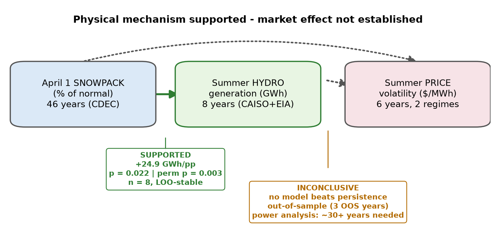
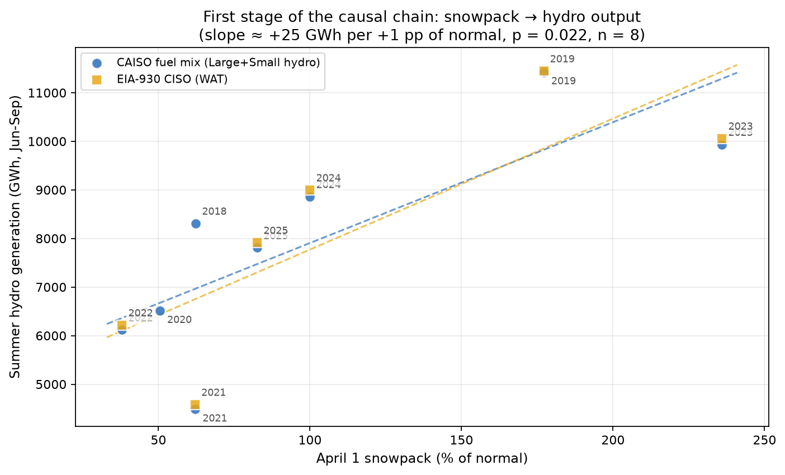
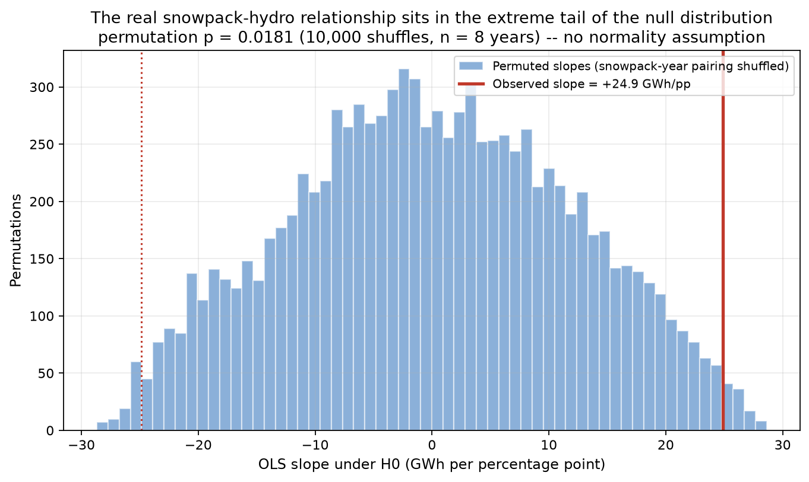
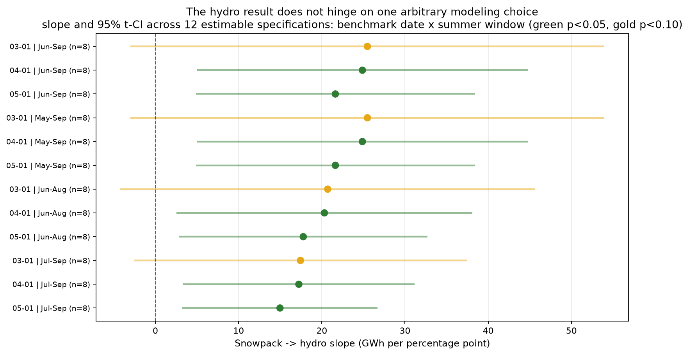
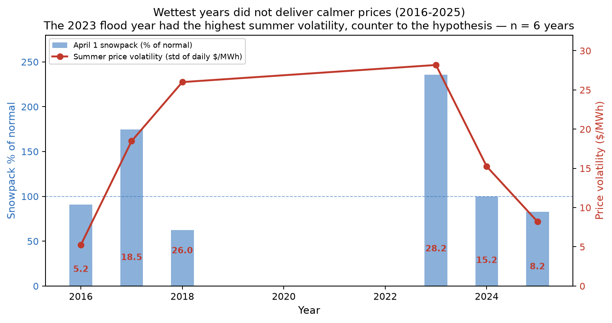
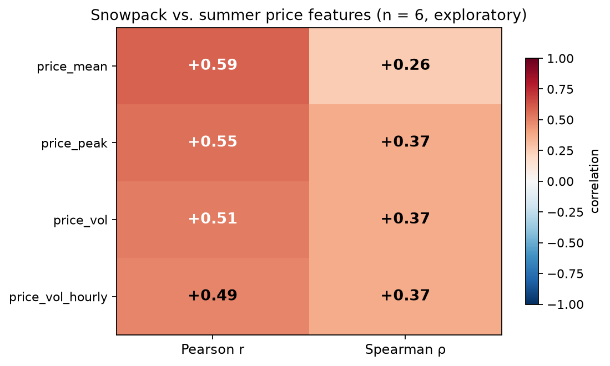
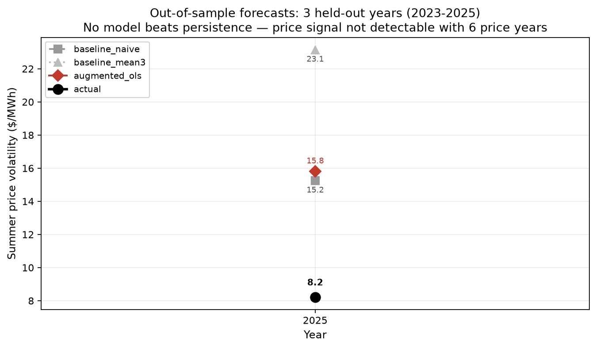
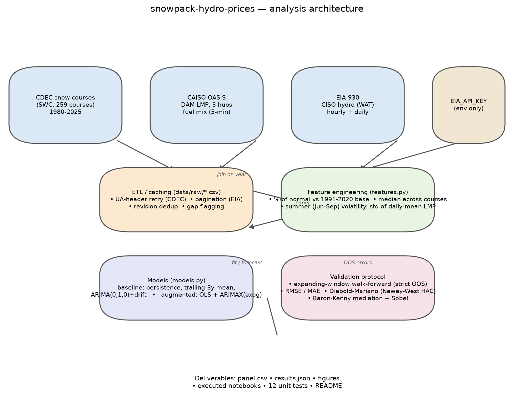

<div align="center">

# Snowpack → Hydropower → Electricity Prices

**Does California's winter snowpack predict summer electricity-market behavior?**

[](https://www.python.org/)
[](LICENSE)
[](https://github.com/namit1333/snowpack-hydro-prices/actions/workflows/tests.yml)

Author: [namit1333](https://github.com/namit1333)

</div>

---

A reproducible causal-chain study: does snowpack predict summer electricity
price behavior through hydroelectric generation? End-to-end ETL → feature
engineering → forecasting → statistical inference, from public data, cached,
unit-tested (31 tests), and reproducibly executable in CI.

Coverage: **46 years** of snowpack (CDEC, 1980–2025) · **8 years** of hydro
generation (CAISO fuel mix + EIA-930 cross-check) · **6 years** of price
history (2016–18 + 2023–25, **two measurement regimes** — see below).

## The project in one figure



---

## Hypotheses and pre-specified tests

The tests below were fixed before looking at the out-of-sample results — this
is a hypothesis test, not a search over models for something significant.

| # | Hypothesis | Test | Verdict |
|---|---|---|---|
| **H1** | Higher April 1 snowpack → more summer hydro generation | OLS + permutation test + bootstrap CI + leave-one-out + 12-specification sensitivity grid | **Supported** (every check agrees) |
| **H2** | Snowpack affects summer price volatility *through* hydro generation | Walk-forward forecasting vs. persistence + Diebold–Mariano + direct hydro→price regression + power analysis | **Inconclusive** (no OOS edge; sample too small to resolve) |

**Key finding:** the physical mechanism is strongly supported; the market
effect is not established with current data. That asymmetry is the result.

**Important limitation:** the price window is 6 years (2016–18 + 2023–25, with
a 2019–22 gap in public records) from **two different measurement regimes**.
Walk-forward forecasts have 3 strictly out-of-sample years (2023–25). A power
analysis (below) says **~12 years are needed for 80% power** to detect even an
effect as strong as the validated hydro link — the null price result is a
data-coverage statement, not a claim that no effect exists.

---

## Two price measurement regimes

The 6-year price window is **not** a single homogeneous series:

- **2016–2018:** one CAISO node (Bayshore, `BAYSHOR2_1_N001`) from an archived
  third-party mirror of OASIS data.
- **2023–2025:** three CAISO trading hubs (NP15, SP15, ZP26) fetched live.

Measured across the three hubs in 2023–25, cross-hub dispersion of summer
volatility is ~10–17% of the mean — an upper bound on the regime difference the
single-node data introduces. Year-to-year volatility swings (5 → 28 $/MWh) are
several times larger, so the volatility comparison is meaningful, but **all
cross-regime model comparisons are treated as exploratory**. Full detail in
[DATA_PROVENANCE.md](DATA_PROVENANCE.md).

---

## Results

### 1. Snowpack → hydro — supported, and robust to how you specify it



| Data source | Slope (GWh/pp) | 95% CI (t, n−2) | p | R² | n |
|---|---|---|---|---|---|
| **CAISO fuel mix** | **+24.9** | **[5.0, 44.8]** | **0.022** | 0.61 | 8 |
| EIA-930 (independent) | +27.0 | [-0.4, 54.3] | 0.052 | 0.65 | 6 |

A 10-pp rise in April 1 snowpack ⇒ ≈ +250 GWh of summer hydro — roughly 3% of
a typical CAISO summer. Four independent robustness checks:

**Permutation test** (no normality assumption — shuffle the snowpack-year
pairing 10,000 times): the observed slope sits in the extreme tail of the null
distribution, **permutation p = 0.018**, closely matching the parametric 0.022.



**Bootstrap CI** (resample years with replacement, 10,000 draws):
**[14.2, 51.8]** vs. the t-based [5.0, 44.8] — broadly agreeing, so the
parametric assumption is not doing the work.

**Leave-one-out:** dropping any single year keeps the slope positive in all 8
fits (+19.8 to +40.8 GWh/pp, all p < 0.07) — not driven by one year.

**Specification sensitivity** — does the number depend on arbitrary modeling
choices? Re-run across every benchmark date the CDEC archive supports (Mar 1,
Apr 1, May 1, Jun 1 — courses are measured on the 1st) × four summer windows:



**12 of 16 specifications are estimable; all 12 slopes are positive
(+15.0 to +25.5 GWh/pp) and 8 of 12 clear p < 0.05.** The conclusion survives
every reasonable specification. (The June 1 benchmark lacks the coverage for a
regression; May–Sep results equal Jun–Sep because the cached fuel-mix data
starts in June.)

### 2. Hydro → price, tested directly (new)

The mediation framework entangles the two links, so the second link is also
tested on its own — does hydro generation *itself* correlate with price
volatility in the overlapping years?

| Slope ($/MWh per GWh) | 95% CI | p | R² | n |
|---|---|---|---|---|
| +0.007 | [-0.016, 0.030] | 0.314 | 0.47 | 4 |

Positive point estimate, nowhere near significant at n = 4. Consistent with
H2 being unresolvable at current coverage — reported for completeness, used
for nothing.

### 3. The price question — forecasting protocol and honest null





**Protocol** (every prediction uses only information available at its forecast
date — verified by an automated leakage test, `tests/test_no_future_leakage.py`):

```
TRAIN          PREDICT (strictly out-of-sample)
2016-2018  →   2023
2016-2023  →   2024
2016-2024  →   2025
```

Walk-forward results, **3 held-out years**:

| Model | RMSE | MAE | Dir. acc. | Note |
|---|---|---|---|---|
| **baseline_naive** | **8.59** | **7.38** | 0.00 | Persistence — predicts "no change" |
| augmented_ols | 9.12 | 7.79 | 0.50 | Snowpack regressor |
| baseline_mean3 | 12.09 | 11.84 | 0.50 | Trailing 3-yr mean |
| baseline_arima | 13.93 | 12.77 | 0.00 | Random walk + drift (closed form) |
| augmented_arimax | 16.09 | 15.05 | 0.00 | ARIMAX w/ snowpack exog. |



**No model beats persistence** — and persistence is a genuinely hard baseline
for volatility, which is itself the quant lesson. The wettest year in the
window (2023, snowpack ≈ 236%) had the *highest* volatility — opposite to the
hypothesis. Directional accuracy is at best a coin flip. The Diebold–Mariano
statistic is reported for completeness only: with three out-of-sample years it
is far too weak for predictive-accuracy inference.

**Why the ARIMA rows look different from a naive library call:** statsmodels
≥ 0.14 rejects ARIMA(0,1,0) with a constant, and an earlier version of this
pipeline silently caught that failure and substituted persistence — making
ARIMA *look* identical to the naive baseline (RMSE 8.60). The silent fallback
was removed; both ARIMA models are now implemented in closed form and fail
loudly. Their true (worse-than-persistence) performance is the table above.

**Snowpack coefficient stability across training windows** (the coefficient
the OLS forecast implicitly relies on):

| Train window | Coef ($/MWh per pp) | p |
|---|---|---|
| 2016–2018 | −0.016 | 0.94 |
| 2016–2023 | +0.053 | 0.60 |
| 2016–2024 | +0.056 | 0.47 |
| 2016–2025 | +0.070 | 0.30 |

Sign flip at the smallest window, never distinguishable from zero — exactly
what the RMSE table would predict, now visible directly.

**Failure analysis — why the controls model collapsed.** The what-if controls
model (snowpack + observed summer temperature, kept out of the leaderboard)
posts RMSE 41.0 vs. 5.6 for snowpack alone on the same folds. Diagnosis rather
than just the number: the design matrix is *not* collinear (condition number
2.0), but temperature correlates with snowpack at −0.59 and, with 3 parameters
against 4 training rows, the added control soaks up variance and destabilizes
the fit. Leave-one-control-out confirms it: removing temperature *improves*
RMSE from 41.0 to 5.6. With this few years, extra parameters hurt — which is
also why no richer model was added.

**Note on multiple comparisons:** the near-threshold p-values (0.022, 0.052,
0.052) come from a small set of *pre-specified* tests, not from searching many
models. The two 0.052 values were independently recomputed and are distinct
computations (an OLS t-test on n = 6 vs. a Newey–West HAC DM test on n = 3)
that happen to round to the same figure. At n ≤ 8 these are exploratory
evidence, not confirmatory.

**Failed hypothesis, stated plainly:** snowpack-augmented price forecasting did
not outperform persistence out-of-sample. The physical snowpack → hydro
relationship does not automatically translate into a short-horizon
price-volatility signal with the available data. That is the finding.

### 4. Power analysis — how much data would this take?

Reframing the main limitation as a quantified, falsifiable claim: *given the
noise in the price-volatility series, how many years would 80% power need to
detect an effect as strong (in R² terms) as the validated hydro link?*

| Years of data | 4 | 6 | 8 | **10–12** | 14 |
|---|---|---|---|---|---|
| Power | 0.21 | 0.48 | 0.69 | **0.80–0.88** | 0.93 |

**≈ 12 years.** The repo holds 6. Filling the 2019–22 gap is the single
highest-leverage extension (see roadmap) — this number says exactly why.

### 5. Mediation — exploratory, not inference

Baron–Kenny mediation is implemented and kept in the repo
(`notebooks/02_mediation_analysis.ipynb`) to demonstrate the decomposition,
but it is **intentionally not used for inference**: with only 3–6 overlapping
price years the Sobel test is uninformative (p ≈ 1.00), so no point estimate
is reported anywhere.

### 6. Monthly panel

`build_monthly_panel()` produces one row per (year, month) of Jun–Sep — 24
rows from the 6 price years vs. 6 annual. **This is 4× the row count, not 4×
the statistical information**: monthly observations within a summer are
correlated, so effective sample size grows by much less. It is the natural
next step for the price legs as history grows, with the correlation caveat
stated up front.

---

## Why this is not a causal claim

This project does **not** establish that snowpack causes electricity prices.

What is supported: snowpack is strongly associated with subsequent hydro
generation. Snowpack is plausibly exogenous to short-run electricity-market
conditions (it accumulates months before the summer and is driven by winter
weather), which makes the *first* link close to a natural experiment. But the
price analysis remains vulnerable to omitted variables: electricity demand,
natural-gas prices, temperature and heat waves, transmission constraints,
reservoir conditions, and other generation. Demand and temperature controls
are partially in place; gas needs an API key (roadmap). Stronger identification
would require the full control set, longer price history, and ideally a
design that isolates exogenous variation in hydro supply.

---

## What I learned

- **Physical predictability does not imply market predictability.** A strong,
  independently-validated physical relationship vanished one link downstream.
- **Simple baselines are hard to beat.** Persistence is a genuinely strong
  forecast for volatility; every fancier model lost to it out-of-sample.
- **Small samples make significance fragile** — hence permutation tests,
  bootstrap CIs, leave-one-out, and a specification grid before believing
  anything.
- **Extra parameters hurt when n is tiny.** The controls model made everything
  worse; the failure analysis explains why.
- **Robustness checks are worth more than model complexity.** The sensitivity
  grid and permutation test changed how much I trust the headline number far
  more than any additional model would have.
- **Silent failure handling corrupts research.** An exception-swallowing
  fallback made ARIMA *look* identical to persistence for months; the leakage
  and loud-failure tests now guard against that class of bug.

---

## Methodology

Why April 1? Why the summer window? Why volatility? Why persistence and
ARIMA baselines? Why walk-forward over random splits? Why Diebold–Mariano over
RMSE? Why leave-one-out over k-fold at n = 8? Why permutation and bootstrap?
Why small-sample t-intervals? Why these controls, and why the controls model
is kept out of the forecast leaderboard?

Each choice is explained in the author's own words in **[METHODS.md](METHODS.md)**.

---

## Data & provenance

Every dataset, its original source, retrieval path, coverage, and
transformation is documented in **[DATA_PROVENANCE.md](DATA_PROVENANCE.md)** —
including the single-node vs. three-hub price regimes above.

| Variable | Description | Units | Source |
|---|---|---|---|
| `snowpack_pct` | April 1 SWC, % of 1991–2020 normal, median of 259 courses | % | CDEC |
| `hydro_gwh` | Summer hydro generation (Large + Small) | GWh | CAISO fuel mix |
| `hydro_gwh_eia` | Same, independent source | GWh | EIA-930 |
| `price_mean` | Mean summer day-ahead LMP | $/MWh | CAISO OASIS |
| `price_vol` | Volatility: std of daily-mean LMP | $/MWh | CAISO OASIS |
| `price_peak` | Max summer daily-mean LMP | $/MWh | CAISO OASIS |
| `demand_mean_mw` | Mean summer demand | MW | EIA-930 (key) |
| `temp_mean_c` | Mean summer daily-max temperature | °C | Open-Meteo |
| `heat_days_38c` | Days ≥ 38 °C (heat waves) | days | Open-Meteo |
| `gas_mean` | Mean summer Henry Hub price | $/MMBtu | EIA (key) |

Known gaps — flagged, never imputed: 2019–22 prices (OASIS paywall), 2020 EIA
hourly hydro (893/2,928 h), 2015 snowpack (drought → index 0). Demand/gas
columns are empty without `EIA_API_KEY`.

---

## Architecture



| Stage | Module |
|---|---|
| Data acquisition | `fetch_cdec.py`, `fetch_caiso_oasis.py`, `fetch_eia.py`, `fetch_controls.py` |
| Feature engineering | `features.py` (yearly + monthly panels, configurable windows) |
| Modeling | `models.py` (baselines, walk-forward, DM, mediation, LOO, stability, failure analysis) |
| Inference | `inference.py` (permutation, bootstrap, power analysis, link test) |
| Sensitivity | `sensitivity.py` (specification grid) |
| Orchestration | `run_pipeline.py` |
| Validation | `tests/` (31 tests incl. future-leakage) + CI: pytest + reproducibility check |

---

## Reproduce

```bash
git clone https://github.com/namit1333/snowpack-hydro-prices.git
cd snowpack-hydro-prices
python -m venv .venv
.venv/Scripts/pip install -r requirements.txt      # Windows
# .venv/bin/pip install -r requirements.txt        # macOS/Linux

# Sample panel: no downloads, no keys
.venv/Scripts/python scripts/make_sample_data.py

# Full pipeline (real data, ~5-10 min; EIA key optional for hydro cross-check + demand/gas)
cp .env.example .env   # add EIA_API_KEY
.venv/Scripts/python -m src.run_pipeline --fetch

# Tests + figures + notebooks
.venv/Scripts/python -m pytest tests/ -v
.venv/Scripts/python scripts/make_figures.py
.venv/Scripts/python scripts/make_notebooks.py

# Reproducibility verification (what CI runs)
.venv/Scripts/python scripts/check_reproducibility.py
```

`requirements.txt` declares **minimum versions** for human readability;
`requirements-lock.txt` is the exact frozen environment used for development.
Requires Python 3.10+. CI runs the unit tests on 3.10–3.12 **and** verifies the
pipeline executes deterministically end-to-end on the sample dataset.

---

## Repository structure

```
snowpack-hydro-prices/
├── README.md  METHODS.md  DATA_PROVENANCE.md
├── requirements.txt  requirements-lock.txt  .env.example
├── .github/workflows/tests.yml        # CI: pytest 3.10-3.12 + reproducibility
├── data/
│   ├── raw/                           # cached source data (regenerable)
│   ├── processed/panel.csv            # yearly panel
│   └── sample/sample_panel.csv        # demo data (no fetch)
├── src/
│   ├── fetch_cdec.py                  # CDEC snow (1980+)
│   ├── fetch_caiso_oasis.py           # CAISO LMP + fuel mix + 2016-18 archive
│   ├── fetch_eia.py                   # EIA-930 hydro
│   ├── fetch_controls.py              # demand, temperature, gas
│   ├── features.py                    # yearly + monthly panels
│   ├── models.py                      # baselines, walk-forward, DM, mediation, LOO
│   ├── inference.py                   # permutation, bootstrap, power, link test
│   ├── sensitivity.py                 # specification grid
│   └── run_pipeline.py                # end-to-end
├── notebooks/                         # executed analysis notebooks
├── scripts/                           # figure/notebook/sample/reproducibility
├── tests/                             # 31 unit tests incl. future-leakage
└── results/                           # figures, tables, results.json
```

---

## Extension roadmap

| Priority | Extension |
|---|---|
| P0 | Fill the 2019–2022 price gap → ~12+ years, the power analysis's threshold |
| P1 | Demand + gas controls into the panel (EIA key) |
| P2 | Monthly mediation on the 24-row panel (with within-summer correlation handling) |
| P3 | Bayesian mediation with credible intervals |

---

## References

- Baron, R. M., & Kenny, D. A. (1986). The moderator-mediator variable
  distinction in social psychological research. *JPSP*, 51(6), 1173-1182.
- Diebold, F. X., & Mariano, R. S. (1995). Comparing predictive accuracy.
  *JBES*, 13(3), 253-263.
- Efron, B. (1979). Bootstrap methods: another look at the jackknife.
  *Annals of Statistics*, 7(1), 1-26.
- Newey, W. K., & West, K. D. (1987). A simple, positive semi-definite,
  heteroskedasticity and autocorrelation consistent covariance matrix.
  *Econometrica*, 55(3), 703-708.

---

*This project investigates — but does not conclusively establish — a causal
link between snowpack and electricity prices. The snowpack → hydro relationship
is strongly supported and robust across specifications; the downstream price
effect remains an open question that the current 6-year price window is
underpowered to resolve.*
