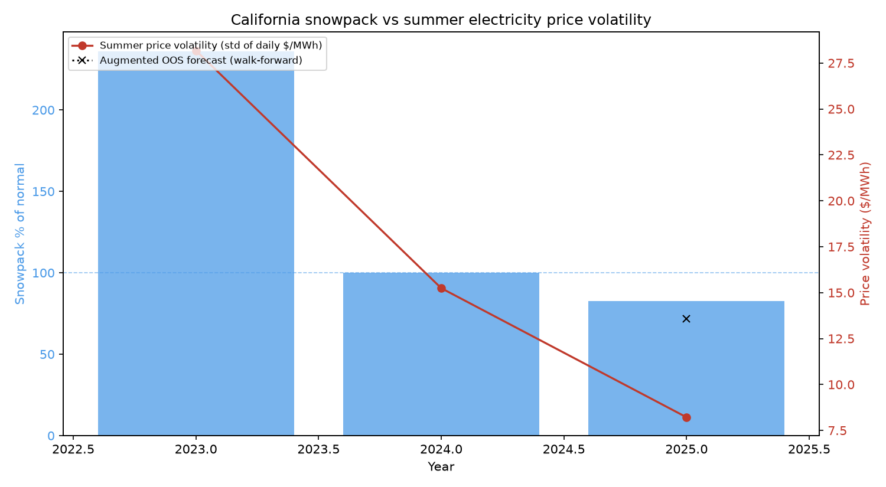

# Snowpack → Hydropower → Electricity Prices

**Research question:** Does winter/spring snowpack in California predict summer
electricity price behavior, through hydroelectric generation?

This repo builds the full causal-chain test: **April 1 snowpack** (the standard
hydrological benchmark) → **summer hydro generation** → **summer day-ahead
price volatility**, with walk-forward validation and a Diebold–Mariano
comparison against persistence baselines.



## Results

### 1. The first stage holds: snowpack predicts summer hydro output

This is the leg of the causal chain with real statistical power. Using 8 summers
(2018–2025) of CAISO fuel-mix data:

| | slope (GWh per +1 pp of normal) | p-value | R² | Pearson r | n |
|---|---|---|---|---|---|
| CAISO fuel mix (`hydro_gwh`) | **+24.9** | **0.022** | 0.61 | 0.78 | 8 |
| EIA cross-check (`hydro_gwh_eia`) | +27.0 | 0.052 | 0.65 | 0.81 | 6 |

A 10-percentage-point rise in April 1 snowpack is associated with roughly
**+250 GWh of summer hydroelectric generation** — statistically significant
and consistent across two independent data sources (they agree within ~2%).

### 2. Price legs (illustrative — 2023–2025 only)

Public CAISO day-ahead LMP history is currently only served from **2023**
onward (older records moved to an authenticated bulk archive; see
[Data coverage](#data-coverage)). With three summers, the price legs are
**illustrative, not conclusive**:

| target | Pearson r (vs snowpack) | Spearman ρ | n |
|---|---|---|---|
| price_mean | +0.99 | 0.5 | 3 |
| price_peak | +1.00 | 1.0 | 3 |
| price_vol | **+0.97** | 1.0 | 3 |
| price_vol_hourly | +0.94 | 1.0 | 3 |

Walk-forward RMSE (expanding window, 1 out-of-sample year — illustrative only):

| model | RMSE | n_OOS |
|---|---|---|
| **augmented_ols** (lag vol + snowpack) | **5.37** | 1 |
| augmented_arimax | 7.03 | 1 |
| baseline_arima | 7.03 | 1 |
| baseline_naive (persistence) | 7.03 | 1 |
| baseline_mean3 | 13.50 | 1 |

The Diebold–Mariano test cannot be computed at n = 1, and the full mediation
analysis (n = 3 overlapping years) is flagged `illustrative` in
[`results/results.json`](results/results.json).

### 3. Plain-English conclusion

> With the data currently publicly accessible, the study **cannot confirm** that
> snowpack predicts summer electricity-price behavior, and the small sample we
> have points the *other* way: the three summers with price data (2023–2025)
> show the wettest year (2023, snowpack ≈ 236% of normal) having the *highest*
> summer price volatility, not the lowest. What *is* firmly supported — on eight
> years of data, with two independent sources — is the first half of the causal
> chain: wet winters reliably produce more summer hydro generation (p ≈ 0.02,
> ~25 GWh per +1 pp of normal). The price response is a real question that this
> dataset is currently too short to answer: the expected channel (more hydro →
> lower, calmer prices) could be swamped by other summer drivers such as heat
> waves and natural-gas prices. Re-running this analysis with the full
> 2016–2025 price archive should settle it.

## Data sources

| Variable | Source | Coverage | Access |
|---|---|---|---|
| April 1 snow water content (% of normal, 259 courses) | [CDEC](https://data.cnra.ca.gov/dataset/california-snow-data) via CNRA open data | 1980–2025 | no key |
| Day-ahead hourly LMP (3 trading hubs) | [CAISO OASIS](https://oasis.caiso.com) via `gridstatus` | **2023–2025** | no key |
| Summer hydro generation (Large + Small hydro) | CAISO fuel mix via `gridstatus` | 2018–2025 | no key |
| Summer hydro generation (cross-check) | [EIA](https://www.eia.gov/opendata/) (EIA-930, CISO/WAT) | hourly 2019–2025, daily 2020–2025 | free key (`EIA_API_KEY`) |

Snowpack **"percent of normal"** is computed per snow course as the April 1 snow
water content divided by that course's 1991–2020 April 1 average (CDEC
convention), then summarized as the **median across courses** each year.

Summer = **June 1 – September 30**. Volatility = standard deviation of
daily-mean day-ahead LMP over the summer (hourly volatility as a robustness
target).

## Reproduce

```bash
python -m venv .venv
.venv/Scripts/pip install -r requirements.txt   # or .venv/bin/pip on macOS/Linux

# (optional) fetch EIA hydro cross-check
export EIA_API_KEY=your_key_here

# fetch everything (CDEC + CAISO; EIA if key set) and run the analysis
.venv/Scripts/python -m src.run_pipeline --fetch

# tests + notebooks
.venv/Scripts/python -m pytest tests/ -q
.venv/Scripts/python scripts/make_notebooks.py
.venv/Scripts/python -m jupyter nbconvert --to notebook --execute --inplace notebooks/*.ipynb
```

Outputs: `results/snowpack_vs_volatility.png`, `results/walkforward_rmse.csv`,
`results/results.json`, executed notebooks in `notebooks/`.

## Data coverage

The analysis window is set by the *price* data: **2023–2025**. CAISO's public
OASIS API no longer serves LMP before 2023; their historical archive
(2016+, [`oasis-bulk.caiso.com`](https://oasis-bulk.caiso.com/)) is behind an
authenticated bulk-downloader that is not scriptable without a browser session.
The pipeline is written so that the moment longer price history is available
(files in `data/raw/caiso_prices_YYYY.csv`), the walk-forward, DM test, and
mediation analysis run at full power — `min_train` adapts automatically.

## Repo structure

```
snowpack-hydro-prices/
├── README.md
├── data/raw/  data/processed/panel.csv
├── src/
│   ├── fetch_cdec.py          # CDEC snow course SWC (1980+)
│   ├── fetch_caiso_oasis.py   # CAISO LMP + fuel mix (gridstatus)
│   ├── fetch_eia.py           # EIA CISO hydro (EIA_API_KEY)
│   ├── features.py            # yearly panel + % of normal index
│   ├── models.py              # baselines, augmented, walk-forward, DM, mediation
│   └── run_pipeline.py        # end-to-end + plot + results
├── notebooks/                 # 01_eda, 02_mediation_analysis, 03_walkforward_backtest
├── scripts/make_notebooks.py
├── tests/                     # unit tests (12 passing)
└── requirements.txt
```

## Limitations

- **Price history (3 years)** is the binding constraint; all price-based
  statistics are illustrative.
- 2015 snowpack index is 0 (extreme drought; most courses had no snow).
- EIA-930 hourly hydro has a data gap in 2020 (flagged missing, not imputed).
- Mediation is a regression-based (Baron–Kenny) descriptive analysis on a tiny
  sample; treat the `proportion mediated` numbers as machinery demos, not
  causal estimates.
